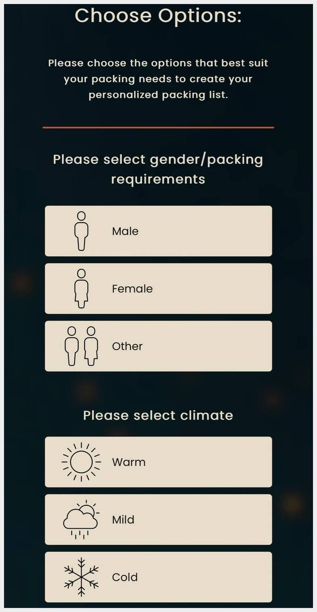
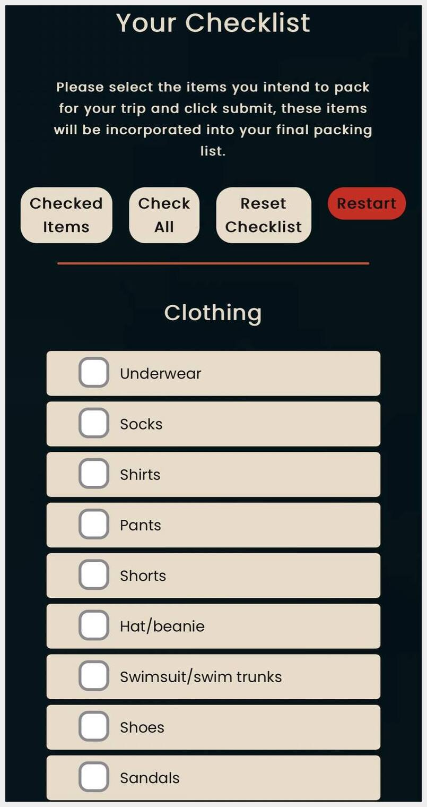
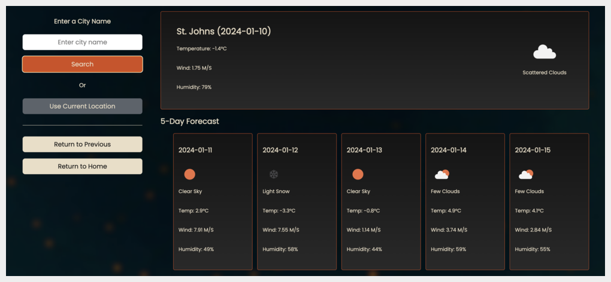

# :airplane: Packing Planner

This Project was created for module 1 of the [Get Coding](https://www.getcoding.ca/) curriculum. I created this project for people like myself who **LOVE** traveling but **HATE** the stressful and frustrating process of packing. This simple packing planner allows the user to select their specific packing requirements and then select the items that they would like to pack from a list tailored to their needs, as well as having the option to add custom items if needed. The user is then given a final list that they can then check off while packing, making the process as stress free as possible!

 

## :thought_balloon: Motivation

As an avid traveler, that dreaded feeling that you may have forgotten something while packing is something I deal with often. I wanted to create a project that would eliminate that feeling and give me the peace of mind that I am not forgetting something important, so I can begin enjoying my trip.

## :white_check_mark: Getting Started

To get started with this project, simply follow these steps:

- Clone the repository.

- Open the project in your preferred code editor.

- Launch the application in a web browser.

or

Click this link to view the live page: [Packing Planner](https://awhalen1999.github.io/Packing-Planner/)

## :computer: Technologies Used

- HTML
- CSS
- JavaScript

## :heavy_plus_sign: Additional Features

- Open weather map API
- Geo location API

Allows the user to browse the upcoming weather forecast for their destination and properly prepare for the elements all in one place!

## :clap: Credits

My coach Lucas Hillier has been a massive help throughout the entire process of creating this project!
